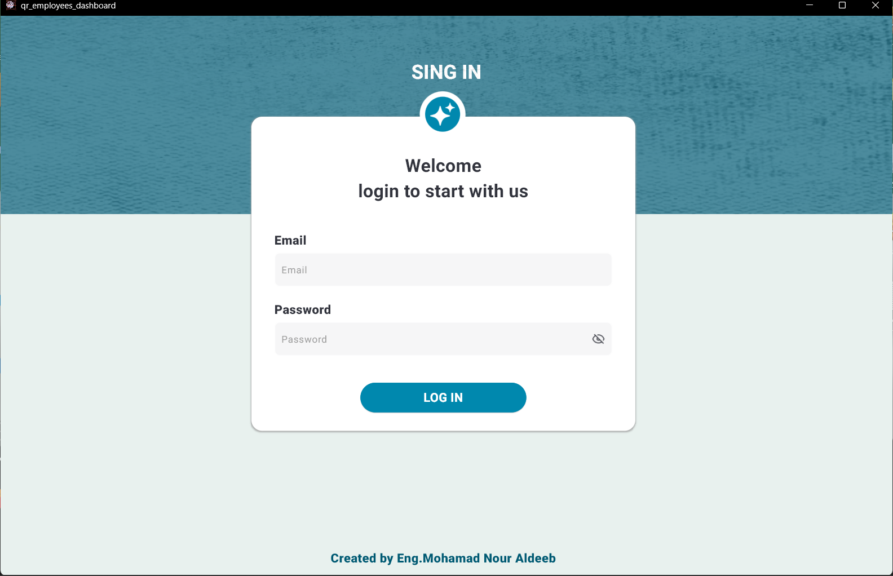
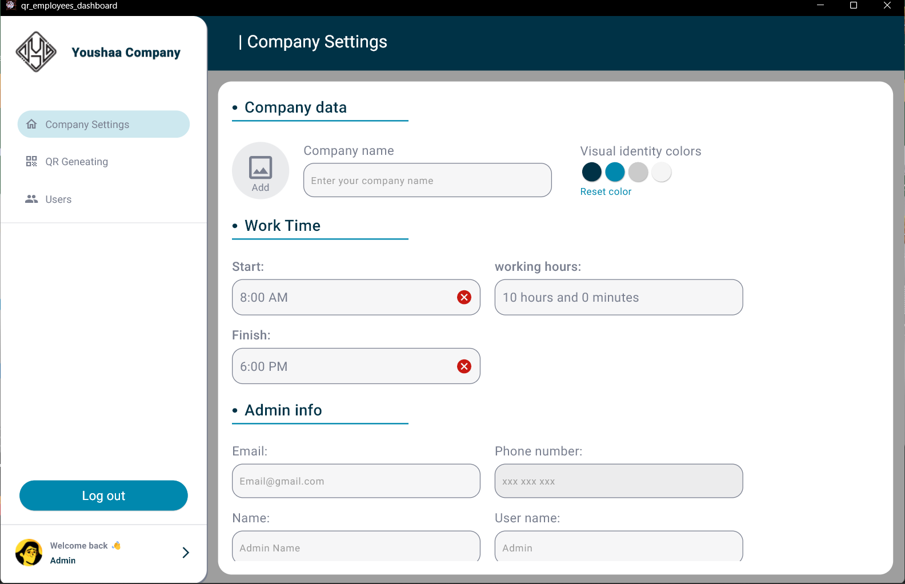
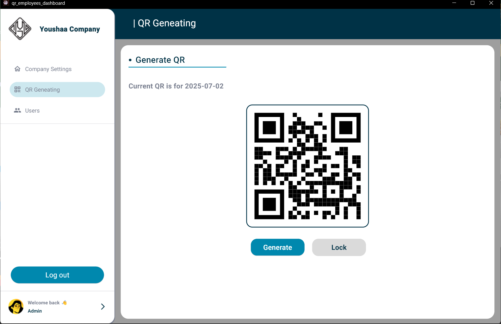
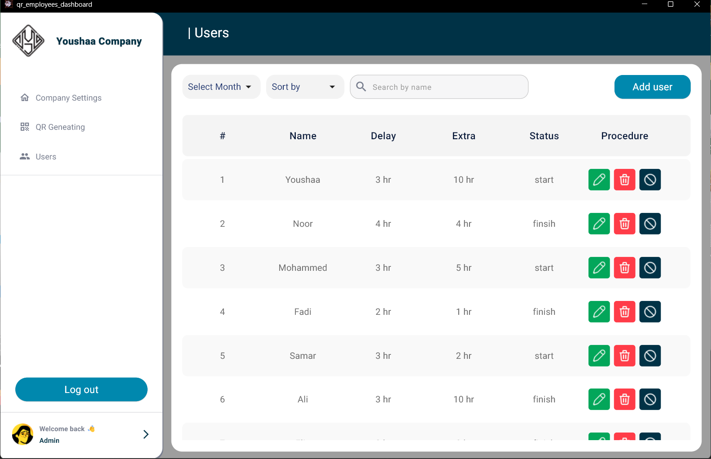
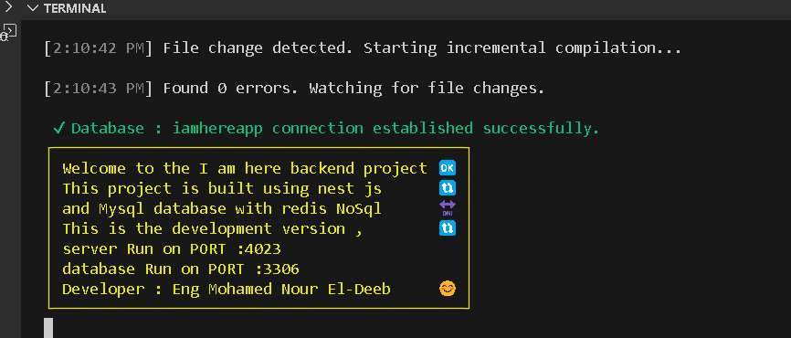

# 🧑‍💼 I Am Here

> A simple and efficient local backend server for employee attendance tracking using QR codes.

---

## 📌 About

**I Am Here** is a lightweight backend system built with [NestJS](https://nestjs.com/). It supports an **embedded MySQL server**, allowing it to function fully offline and independently.

This system allows companies to:

- Create company accounts
- CRUD for users accounts
- Set working hours
- Generate QR codes for employees
- Track check-in/check-out times
- Calculate daily work hours including overtime/undertime
- View daily/monthly attendance reports

Admins can manage employees, while employees can scan QR codes to log their attendance.

---

## ⚙️ Features

- ✅ **Fully Local Backend**
  - Runs without depending on external environments (e.g., XAMPP)
  - Supports internal MySQL server setup if you want !?.
- 🔐 **Environment-Based Configuration**
  - All settings controlled via `.env` file
- 📦 **Redis Integration**
  - Used for caching to improve performance and reduce database load
- 📱 **QR Code Attendance System**
  - Employees scan QR on entry and exit
  - Logs timestamps automatically
- 📊 **Time Tracking & Calculation**
  - Calculates total hours worked per day
  - Tracks overtime and undertime
- 👤 **Employee Management (Admin)**
  - Add, edit, deactivate employees
  - View attendance logs (daily/monthly)
- 📁 **Ready for Expansion**
  - Designed to integrate with Flutter frontend soon
  - Planned to build as a standalone **Windows/Linux EXE app**

---

## 🛠️ Tech Stack

| Layer          | Technology      |
| -------------- | --------------- |
| Framework      | NestJS          |
| Database       | MySQL _(local)_ |
| ORM            | SequelizeORM    |
| Caching        | Redis           |
| Authentication | JWT             |
| Environment    | `.env` config   |

---

### 📦 Installation

1. **Clone the repository**

   ```bash
   git clone https://github.com/YOUR_USERNAME/i-am-here.git
   cd i-am-here
   ```

2. **Install dependencies**

   ```bash
   npm install
   ```

3. **Set up environment variables**

   Create a `.env` file in the root directory and add the env_example file content and change it as you like:

   > 💡 This project supports running a local MySQL server without depending on external tools like XAMPP by make RUN_DB_LOCAL=true and DB_PORT=3307 in .env . the mysql server in main folder just unzip it .

4. **Start the development server**

   ```bash
   npm run start:dev
   ```

   The server will be available at:  
   [`http://localhost:4023`](http://localhost:4023)

---

## 🖼 Screenshots

### Login Page



### Dashboard



### Qr



### User



### Serverr



---

🧪 Future Plans
🖥️ Build a standalone desktop version (exe) for Windows/Linux
🎨 Connect with Flutter-based frontend
📄 Export attendance reports (PDF/Excel)
📲 Mobile app support
📧 Email notifications for admins

❤️ Contribution
Contributions are always welcome!
Feel free to open issues or submit pull requests to help improve this project.

📄 License
@ Eng : mohamad noor aldeeb
